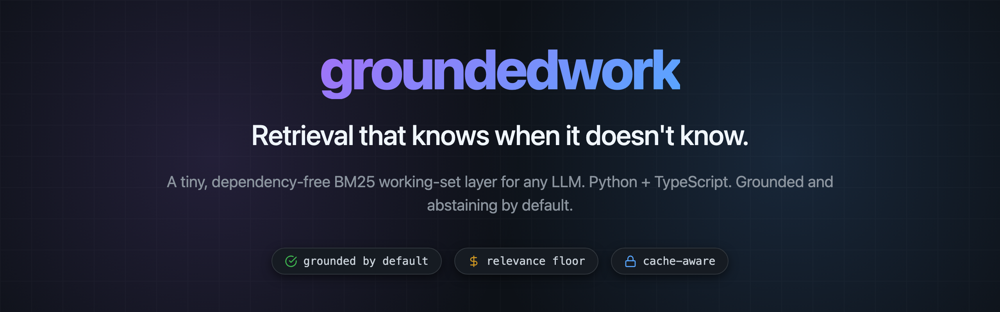
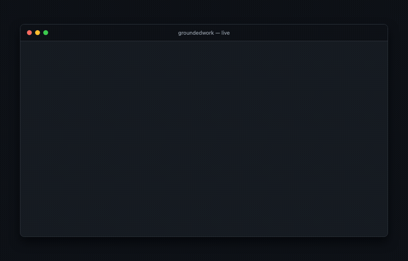
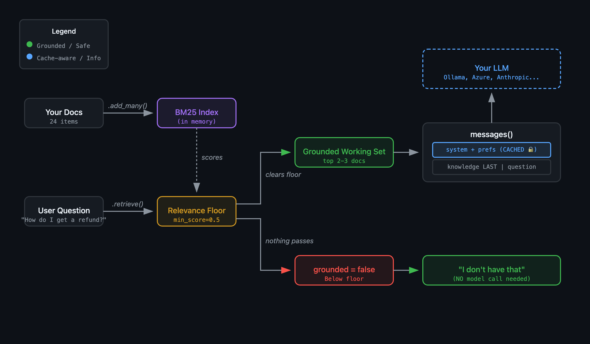

<p align="center">
  
</p>

<p align="center">
  <a href="https://github.com/idanshimon/groundedwork/actions/workflows/tests.yml"></a>
  
  
  
  
</p>

# groundedwork

**Retrieval that knows when it doesn't know.**

A tiny, dependency-free retrieval layer that gives an LLM a knowledge base bigger than its context window — pulling in only the documents that answer the question, and staying honestly silent when nothing matches.

Same intuitive API in **Python** and **TypeScript**, with behavior verified identical against a shared test fixture.

<p align="center">
  
</p>

| | Package | Tests | Install |
|---|---|---|---|
| 🐍 **Python** | [`python/`](python/) · `groundedwork` | 23 passing | `pip install groundedwork` |
| 🟦 **TypeScript** | [`ts/`](ts/) · `groundedwork` | 20 passing | `npm install groundedwork` |

```python
from groundedwork import GroundedWork

kb = GroundedWork().add_many(docs)
kb.ask("How do I get a refund?")     # {'grounded': True,  'answer': '...', 'source': 'returns'}
kb.ask("capital of France?")          # {'grounded': False, 'answer': "I don't have that...", 'source': None}
```


## Try it live (in your browser)

A zero-dependency playground runs the **real engine** locally — no mockups, no hardcoded numbers. You type a question and watch the actual pipeline: tokenized terms → real BM25 scores vs the relevance floor → the grounded/abstain decision → the exact cache-aware prompt your model would receive.

```bash
make play          # then open http://localhost:8000
# or:  python playground/server.py
```

It imports the installed `groundedwork` package and calls the same `retrieve` / `prompt` / `messages` / `ask` methods the tests use. Five guided scenarios walk you through a grounded answer, an honest abstention, the keyword paraphrase gap, and the cache-aware prompt assembly. Expand **“show what happened”** on any answer to see every stage.


## What makes it different

Built on the ideas of **[ContextForge](https://github.com/Betanu701/ContextForge)** by Derek Thomas. After a week of empirically testing that SDK (8 models, 216 trials), we shipped the lessons as **defaults**:

- **Grounded by default** — a strict "answer only from the knowledge, don't guess" prompt. Measured 0/72 hallucinations vs 5/72 for a permissive prompt.
- **Relevance floor by default** — when nothing matches well, inject *nothing*, not the least-bad distractors.
- **Abstention is first-class** — `grounded == False` is a real return value, so you can skip the LLM call entirely on a miss.
- **Cache-aware assembly** — `messages()` pins a stable `[system + prefs]` prefix dead-first and puts the volatile retrieved knowledge *last*, so a prompt-caching endpoint (Anthropic / OpenAI / Azure) reuses the whole prefix across calls. ContextForge does the opposite — it buries retrieved content in the system block, busting the cache every query.
- **One obvious, flat API** — the intuitive path is the safe path.
- **Cross-language parity** — Python and TypeScript run the same `fixtures/nimbus.json`, so they can't silently drift.

## The honest limitation

It's BM25 keyword retrieval — fast, transparent, no model required, but it matches on words, so **paraphrased questions can miss** (and occasionally match the wrong doc with false confidence). Grounding + the floor limit the blast radius; **hybrid embedding retrieval to actually close the gap is the v0.2 headline**, opt-in so the zero-dependency default stays zero-dependency. We shipped the honest version first.

## How it works

<p align="center">
  
</p>

Your docs are indexed in memory (BM25, no embeddings). A question is scored against them; the **relevance floor** gates the result. If something clears the floor, you get a grounded working set assembled into a cache-optimal prompt for *your* model. If nothing does, `grounded` is `false` and you abstain — no model call. groundedwork never calls the model itself; **you bring your own** (local, Azure, OpenAI, Anthropic — anything). Full details in [`docs/ARCHITECTURE.md`](docs/ARCHITECTURE.md).

## Repository layout

```
groundedwork/
├── python/         pip package — reference implementation
├── ts/             npm package — TypeScript mirror
├── fixtures/       shared cross-language test fixtures (the parity contract)
├── bench/          cross-language parity harness (emitters + golden snapshot)
├── playground/     zero-dependency live demo server (the real engine)
├── docs/           ARCHITECTURE.md — algorithm, design, interface contract
├── AGENTS.md       machine-oriented guide for AI agents using/extending this
├── Makefile        `make test` runs everything (both suites + parity)
└── LICENSE         MIT
```

## Tests

```bash
make test     # python suite + typescript suite + cross-language parity, one command
```

The two implementations are independent code but **one specification**. A golden-output harness (`bench/`) proves they produce numerically identical retrieval results to 9 decimal places — so they can't silently drift. CI runs it on Python 3.9/3.11/3.13 and Node 18/20/22. See [`docs/ARCHITECTURE.md`](docs/ARCHITECTURE.md) for the algorithm and design, and [`AGENTS.md`](AGENTS.md) if you're an AI agent integrating or extending it.

## Credit

The core mechanism — a flat, retrieved "working set" so context cost stops scaling with knowledge size — is Derek Thomas's, from [ContextForge](https://github.com/Betanu701/ContextForge). groundedwork is an independent reimplementation that ships our empirical lessons as defaults and adds a second language. If you build code-heavy or multi-turn agents, look at ContextForge too.

MIT licensed. Built for the empirical version.
